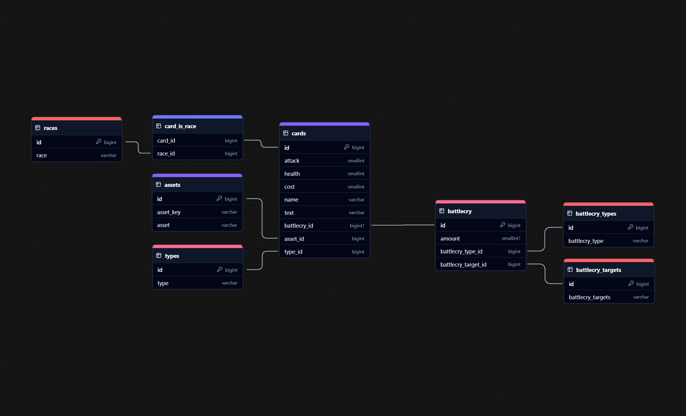

# **PhaserStone**  

_PhaserStone is definitely its own card game in which you use cards to defeat your opponent cards and set his health to 0 and is not at all a copy of Hearthstone._

## **Table of Contents**

1. [Features](#features)  
2. [Installation](#installation)  
3. [Database Schema](#database-schema)  
4. [Build and Run](#build-and-run)  
5. [Technologies Used](#technologies-used)  

---

## **Features**  

- Create your own deck to compete with the enemy!
- Summon powerful cards with massive effects!
- Reduce the enemy's health to 0 and win glory I guess?

## **Installation**  

1. Clone the repository:  

   ```cmd
   git clone https://github.com/kpoptrashBlaenk/PhaserStone.git
   cd PhaserStone
   ```

2. Install dependencies:  

   ```cmd
   npm install
   ```

3. Set up environment variables and fill it out.

    ```cmd
    copy env.template .env
    ```

4. Set up the database.

    ```cmd
    npm run migrate
    npm run insert
    ```

## **Database Schema**  



## **Build and Run**  

- **Build with Webpack:**  

  ```cmd
  npm run build
  ```

- **Start the Express server:**  

  ```cmd
  npm run server
  ```

- **Development mode:**  

  ```cmd
  npm run dev
  ```

## **Technologies Used**  

- **Typescript** – Language
- **Phaser 3** – Game framework
- **Express.js** – Backend server
- **Webpack** – Bundling
- **TS-Node.js** – Typescript runtime
- **PostgreSQL** – Database
